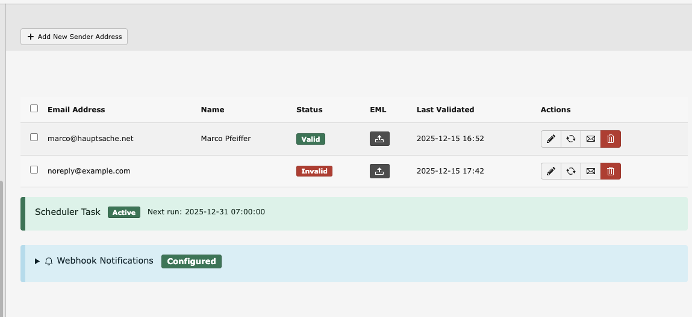
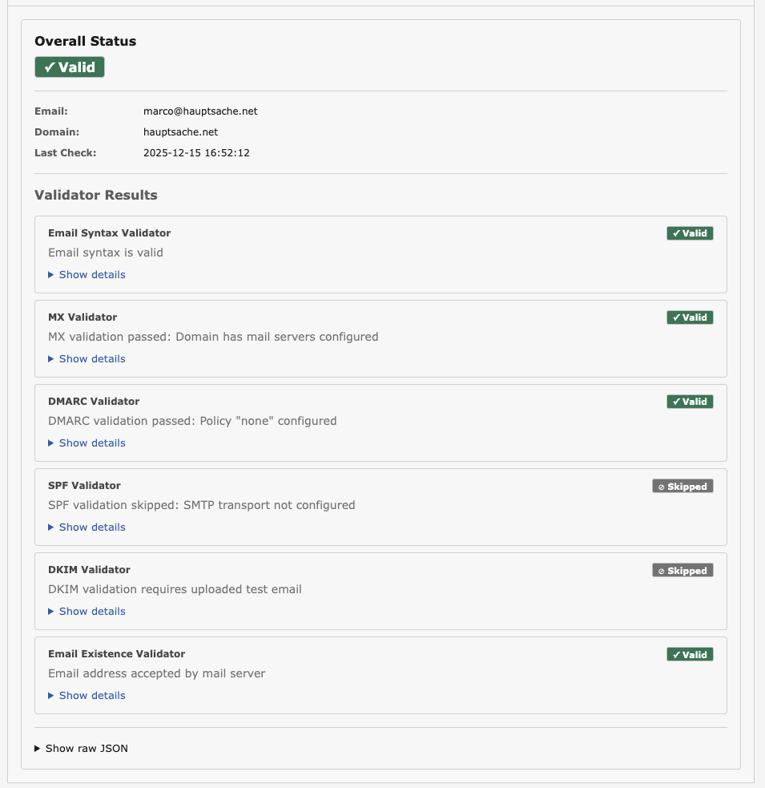

# TYPO3 Extension: Mail Sender Configuration

Configure and validate email sender addresses with DNS and deliverability checks for TYPO3 CMS.

**Funded by the TYPO3 Community Budget Q4 2025** — [Learn more](https://typo3.org/article/members-have-selected-four-ideas-to-be-funded-in-quarter-4-2025)

## The Problem

Email delivery fails silently. Your TYPO3 site sends emails, but they never arrive — or worse, they land in spam. Common causes:

- **SPF misconfiguration**: Your SMTP server isn't authorized to send for your domain
- **Missing DKIM**: Emails aren't signed, reducing trust
- **No DMARC policy**: Receiving servers don't know how to handle authentication failures
- **Invalid addresses**: Typos or non-existent sender addresses cause bounces
- **Missing MX records**: The sender domain can't receive replies

These issues are invisible until someone reports missing emails. By then, you've lost form submissions, notifications, and customer trust.

## The Solution

This extension validates sender addresses *before* they cause problems. Configure your sender addresses once, validate them, and use them across your TYPO3 site with confidence.

## What Gets Validated

| Check | What It Does |
|-------|--------------|
| **Email Syntax** | Validates RFC 5322 compliance — catches typos and malformed addresses |
| **MX Records** | Confirms the domain has mail servers configured |
| **SPF** | Verifies your TYPO3 SMTP server is authorized to send for this domain |
| **DKIM** | Checks email signatures are properly configured (requires test email) |
| **DMARC** | Analyzes authentication policy and provides recommendations |
| **Email Existence** | Confirms the mail server accepts the address |

Validation runs automatically and results are cached. Upload a test email (EML file) for complete SPF/DKIM/DMARC validation against your actual mail flow.

## Features

- Manage sender addresses in the TYPO3 backend
- Visual validation status in the record list
- CLI command: `mail:sender:validate`
- Integration with TYPO3 System Information module
- Integration with ext:form (validated sender dropdown)
- Scheduler task for periodic re-validation

## Screenshots

### Backend Module


*Manage sender addresses with validation status, scheduled re-validation, and webhook notifications.*

### Validation Details


*Detailed validation results showing individual checks for syntax, MX, SPF, DKIM, DMARC, and email existence.*

### System Reports Integration


*Integration with TYPO3 System Reports showing sender address status at a glance.*

## Requirements

- TYPO3 13.4 or later
- PHP 8.1 or later
- Optional: `mika56/spfcheck` for full SPF validation

## Installation

```bash
composer require hn/typo3-mail-sender
```

## Usage

### Managing Sender Addresses

1. Navigate to the **List** module
2. Select the **root page** (ID: 0)
3. Create new **"Mail Sender Address"** records

Each record contains:
- **Sender Email Address**: The email to use as sender
- **Sender Name**: Display name for the sender
- **EML File**: Optional test email for SPF/DKIM/DMARC validation

### CLI Validation

Validate all sender addresses:
```bash
vendor/bin/typo3 mail:sender:validate
```

Validate a specific address:
```bash
vendor/bin/typo3 mail:sender:validate --email=info@example.com
```

### Integration with ext:form

The extension provides a `SenderEmailAddress` form element that shows a dropdown of validated sender addresses instead of a freetext field.

## Development

### Running Tests

```bash
composer test
```

### Test Coverage

- Basic CRUD operations
- Record soft-delete and visibility
- TCA configuration
- Database schema

## Contributing

We welcome contributions from the TYPO3 community!

- Share feedback via [GitHub Issues](https://github.com/hauptsacheNet/typo3-mail-sender)
- Report bugs
- Improve documentation
- Submit pull requests

## Roadmap

### Phase 1: Foundation ✅
Basic extension structure with sender address management in the TYPO3 backend.

### Phase 2: Core Validation ✅
Complete email validation system with DNS checks, SPF/DKIM/DMARC analysis, and status reporting.

### Phase 3: Integration & Adoption 🔄
- ✅ Integration with ext:form
- 📋 TCA Extra Field API for third-party extensions
- 📋 Documentation for extension developers

### Phase 4: Polish & Import 🔄
- ✅ Import from `$GLOBALS['TYPO3_CONF_VARS']['MAIL']`
- 📋 Import from TypoScript configurations
- 📋 Reference tracking (where sender addresses are used)
- 📋 TER release

**Target Release:** December 2025

## License

GPL-2.0-or-later

## Authors

- **Marco Pfeiffer** — marco@hauptsache.net
- **TYPO3 Community** — Funded by Community Budget Q4 2025
