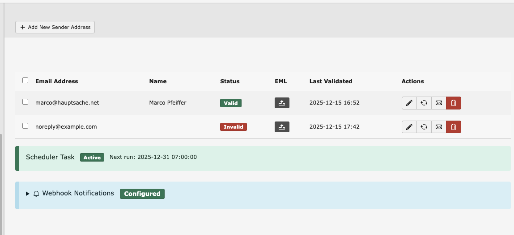
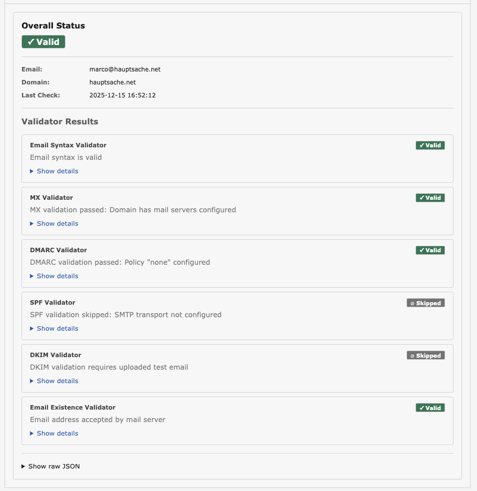
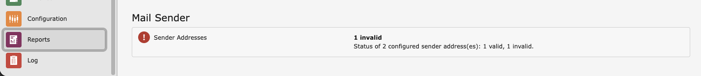

# TYPO3 Extension: Mail Sender Configuration

Configure and validate email sender addresses with DNS and deliverability checks for TYPO3 CMS.

**Funded by the TYPO3 Community Budget Q4 2025** — [Learn more](https://typo3.org/article/members-have-selected-four-ideas-to-be-funded-in-quarter-4-2025)

## The Problem

Email delivery fails silently. Your TYPO3 site sends emails, but they never arrive — or worse, they land in spam. Common causes:

- **SPF misconfiguration**: Your SMTP server isn't authorized to send for your domain
- **Missing DKIM**: Emails aren't signed, reducing trust
- **No DMARC policy**: Receiving servers don't know how to handle authentication failures
- **Invalid addresses**: Typos or non-existent sender addresses cause bounces
- **Missing MX records**: The sender domain can't receive replies

These issues are invisible until someone reports missing emails. By then, you've lost form submissions, notifications, and customer trust.

## The Solution

This extension validates sender addresses *before* they cause problems. Configure your sender addresses once, validate them, and use them across your TYPO3 site with confidence.

## What Gets Validated

| Check | What It Does |
|-------|--------------|
| **Email Syntax** | Validates RFC 5322 compliance — catches typos and malformed addresses |
| **MX Records** | Confirms the domain has mail servers configured |
| **SPF** | Verifies your TYPO3 SMTP server is authorized to send for this domain |
| **DKIM** | Checks email signatures are properly configured (requires test email) |
| **DMARC** | Analyzes authentication policy and provides recommendations |
| **Email Existence** | Confirms the mail server accepts the address |

Validation runs automatically and results are cached. Upload a test email (EML file) for complete SPF/DKIM/DMARC validation against your actual mail flow.

## Features

- Manage sender addresses in the TYPO3 backend
- Visual validation status in the record list
- CLI command: `mail:sender:validate`
- Integration with TYPO3 System Information module
- Integration with ext:form (validated sender dropdown)
- Scheduler task for periodic re-validation

## Screenshots

### Backend Module


*Manage sender addresses with validation status, scheduled re-validation, and webhook notifications.*

### Validation Details


*Detailed validation results showing individual checks for syntax, MX, SPF, DKIM, DMARC, and email existence.*

### System Reports Integration


*Integration with TYPO3 System Reports showing sender address status at a glance.*

## Requirements

- TYPO3 12.4, 13.4 or 14.3 (LTS)
- PHP 8.1 or later (TYPO3 14 requires PHP 8.2+)
- Optional: `mika56/spfcheck` for full SPF validation

## Installation

```bash
composer require hn/typo3-mail-sender
```

## Usage

### Managing Sender Addresses

1. Navigate to the **List** module
2. Select the **root page** (ID: 0)
3. Create new **"Mail Sender Address"** records

Each record contains:
- **Sender Email Address**: The email to use as sender
- **Sender Name**: Display name for the sender
- **EML File**: Optional test email for SPF/DKIM/DMARC validation

### CLI Validation

Validate all sender addresses:
```bash
vendor/bin/typo3 mail:sender:validate
```

Validate a specific address:
```bash
vendor/bin/typo3 mail:sender:validate --email=info@example.com
```

### Integration with ext:form

The extension provides a `SenderEmailAddress` form element that shows a dropdown of validated sender addresses instead of a freetext field.

### Importing senders from external providers

Sender addresses are auto-detected from several sources whenever sender
detection runs (when you open the backend module and during the scheduler
task). Out of the box this includes the TYPO3 default mail configuration and
the sender addresses configured in ext:form finishers.

#### Brevo

If you send through [Brevo](https://www.brevo.com/), the extension can import
your verified senders automatically:

1. Create a Brevo **v3 API key** (Settings → SMTP & API → API keys, starts with
   `xkeysib-`). This is **not** the same as your SMTP key.
2. Open the extension configuration (Admin Tools → Settings → Extension
   Configuration → `mail_sender`) and paste the key into **Brevo API key**.

From then on, sender detection pulls the list from
`https://api.brevo.com/v3/senders` and imports the **active** senders. Leave the
field empty to disable the import.

Notes:

- Only **active** Brevo senders are imported. The import is additive: senders
  that are later deactivated or removed in Brevo are **not** automatically
  disabled or deleted locally.
- The API response is cached for 60 seconds (in the *system* cache group), which
  also rate-limits the API. Flushing the system caches forces an immediate
  refresh.

> **More providers welcome.** The importer is built around a simple provider
> interface (`SenderAddressSourceProviderInterface`). If you use another email
> service provider that exposes its senders via an API — or send via SMTP and
> would like that detected — please open an issue or a pull request; additional
> providers are easy to add.

## Development

### Running Tests

Functional / unit tests (host PHP + SQLite):

```bash
composer test
```

#### End-to-end tests (Playwright)

The end-to-end suite drives a real TYPO3 backend with Playwright and verifies
the three user-facing surfaces against all supported TYPO3 versions (12.4, 13.4,
14.3):

1. the **ext:form integration** (the validated sender-address dropdown is
   injected into the form editor and the form can be saved),
2. the **validation backend module** (lists sender addresses and revalidates),
3. the **List module** (lists and creates Mail Sender Address records).

```bash
# Run against the currently installed TYPO3 version
Build/runTests.sh -s e2e --no-docker

# Run against a specific TYPO3 version (installs it via composer)
Build/runTests.sh -s e2e -t 12.4 --no-docker
Build/runTests.sh -s e2e -t 13.4 --no-docker
Build/runTests.sh -s e2e -t 14.3 --no-docker
```

The runner sets up an SQLite-backed TYPO3 instance, seeds a validated sender
address and a form definition, starts the PHP built-in web server and runs the
Playwright specs in `Build/tests/playwright/`. CI runs the same suite across the
three versions (see `.github/workflows/tests.yml`).

### Test Coverage

- Basic CRUD operations
- Record soft-delete and visibility
- TCA configuration
- Database schema
- End-to-end coverage of the form editor, validation module and List module

## Contributing

We welcome contributions from the TYPO3 community!

- Share feedback via [GitHub Issues](https://github.com/hauptsacheNet/typo3-mail-sender)
- Report bugs
- Improve documentation
- Submit pull requests

## Roadmap

### Phase 1: Foundation ✅
Basic extension structure with sender address management in the TYPO3 backend.

### Phase 2: Core Validation ✅
Complete email validation system with DNS checks, SPF/DKIM/DMARC analysis, and status reporting.

### Phase 3: Integration & Adoption 🔄
- ✅ Integration with ext:form
- 📋 TCA Extra Field API for third-party extensions
- 📋 Documentation for extension developers

### Phase 4: Polish & Import 🔄
- ✅ Import from `$GLOBALS['TYPO3_CONF_VARS']['MAIL']`
- ✅ Import from Brevo (Email Service Provider) API
- 📋 Import from TypoScript configurations
- 📋 Reference tracking (where sender addresses are used)
- 📋 TER release

**Target Release:** December 2025

## License

GPL-2.0-or-later

## Authors

- **Marco Pfeiffer** — marco@hauptsache.net
- **TYPO3 Community** — Funded by Community Budget Q4 2025
